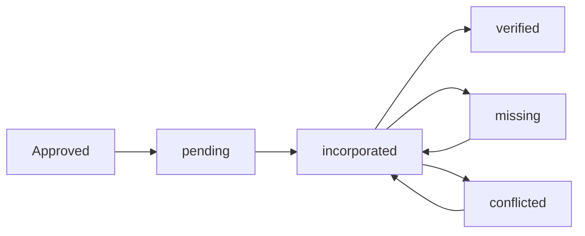

# Change Request Incorporation Tracking System

## 📋 Overview

The **Incorporation Tracking System** provides a comprehensive solution for managing the lifecycle of approved change requests from approval to verification in your production database. This system addresses the critical challenge of tracking which changes have been incorporated into your main database and verifying their presence after external data synchronization.

## 🔄 The Problem & Solution

### **The Problem:**
1. **Approved changes get overwritten** during external database sync
2. **No tracking** of which changes were successfully incorporated upstream
3. **No mechanism** to preserve local changes not yet in external source
4. **No audit trail** of incorporation status

### **The Solution:**
A complete tracking system with:
- ✅ **Incorporation Status Tracking** - Track each change through its lifecycle
- 🔍 **Post-Sync Verification** - Automatically verify changes after sync
- 📊 **Visual Dashboard** - Real-time status overview for administrators
- 🤖 **Automated Commands** - CLI tools for managing the process
- 📝 **Audit Trail** - Complete history of all incorporation activities

## 🏗️ System Architecture

### **Database Schema**

New fields added to `change_requests` table:

```sql
-- Incorporation status tracking
incorporation_status ENUM('pending', 'incorporated', 'verified', 'missing', 'conflicted') DEFAULT 'pending'

-- Incorporation tracking
incorporated_at TIMESTAMP NULL
incorporated_by VARCHAR(255) NULL
incorporation_details JSON NULL
incorporation_notes TEXT NULL

-- Sync verification tracking
last_sync_verified_at TIMESTAMP NULL
sync_verification_details JSON NULL
```

### **Status Flow**



**Status Definitions:**
- **`pending`** - Approved but not yet incorporated into main DB
- **`incorporated`** - Successfully incorporated into main DB
- **`verified`** - Verified present in external sync
- **`missing`** - Missing from external sync (needs re-incorporation)
- **`conflicted`** - Conflicts with external data (needs manual review)

## 🛠️ Core Components

### **1. ChangeRequestIncorporationService**
- **Location**: `app/Services/ChangeRequestIncorporationService.php`
- **Purpose**: Core business logic for incorporation tracking
- **Key Methods**:
  - `markAsIncorporated()` - Mark changes as incorporated
  - `verifyAgainstSync()` - Verify changes against current database
  - `getIncorporationSummary()` - Generate status reports

### **2. Artisan Commands**

#### **Mark Changes as Incorporated**
```bash
# Mark specific change requests
php artisan changes:mark-incorporated 1,2,3 --by="Your Name"

# Mark all pending approved changes
php artisan changes:mark-incorporated --all-approved --by="Your Name"

# Interactive mode
php artisan changes:mark-incorporated
```

#### **Verify Incorporated Changes**
```bash
# Verify all incorporated changes
php artisan changes:verify-incorporated

# Auto-run without prompts (for automation)
php artisan changes:verify-incorporated --auto
```

### **3. Dashboard Integration**
- **Location**: `resources/views/change-requests/partials/incorporation-status.blade.php`
- **Features**:
  - Real-time status overview
  - Pending incorporation alerts
  - Verification needed notifications
  - Quick action buttons
  - Command instructions modal

### **4. Automatic Verification**
- Runs automatically after geographical data sync
- Integrated into `GeographicalDataService`
- Logs results for monitoring

## 📖 Usage Workflow

### **Step 1: Normal Change Request Process**
1. Create and submit change request
2. Admin reviews and approves
3. Status becomes `approved` with `incorporation_status: pending`

### **Step 2: Incorporate Changes into Main Database**
After manually applying approved changes to your main database:

```bash
# Mark as incorporated
php artisan changes:mark-incorporated --all-approved --by="Database Admin"
```

### **Step 3: Sync with External Data**
Run your normal geographical data sync:

```bash
php artisan geo:sync --force
```

The system automatically verifies incorporated changes after sync.

### **Step 4: Review Results**
Check the dashboard or run verification manually:

```bash
php artisan changes:verify-incorporated
```

### **Step 5: Handle Missing Changes**
For changes marked as `missing`:
1. Re-incorporate them into your main database
2. Mark them as incorporated again
3. Wait for next sync to verify

## 🎯 Dashboard Features

### **Status Overview Cards**
Visual cards showing count by status:
- ⏳ **Pending** - Awaiting incorporation
- 🔄 **Incorporated** - Applied to main DB
- ✅ **Verified** - Confirmed in sync
- ⚠️ **Missing** - Not found in sync
- ❌ **Conflicted** - Data mismatch

### **Action Lists**
- **Pending Incorporation** - Changes ready to be applied
- **Need Verification** - Changes awaiting verification
- **Recent Incorporations** - Recently processed changes

### **Quick Actions**
- 📝 **Mark as Incorporated** - Interactive command helper
- 🔍 **Verify Changes** - Run verification process
- ⚠️ **View Missing Changes** - Filter to missing changes

## 🔧 Advanced Features

### **Verification Logic**
The system verifies changes by:

1. **Modifications** - Checks if modified records have expected values
2. **Additions** - Verifies new records exist with correct data
3. **Deletions** - Confirms deleted records are no longer present

### **Conflict Detection**
When verification finds data mismatches:
- Status set to `conflicted`
- Detailed mismatch information stored
- Manual review required

### **Backup Integration**
Works seamlessly with existing backup system:
- Backups created before sync
- Restore capability if needed
- Audit trail maintained

## 📊 Monitoring & Reporting

### **Log Messages**
- **Info**: Successful incorporations and verifications
- **Warning**: Missing changes detected
- **Error**: Conflicts or verification failures

### **Status Reports**
Generate comprehensive reports showing:
- Total approved changes
- Breakdown by incorporation status
- Recent activity
- Pending actions

## 🚨 Troubleshooting

### **Common Issues**

#### **Changes Marked as Missing**
**Cause**: Changes not yet incorporated upstream
**Solution**: Re-incorporate changes and mark them again

#### **Changes Marked as Conflicted**
**Cause**: Data mismatch between expected and actual values
**Solution**: Manual review and resolution required

#### **Verification Failures**
**Cause**: Database connectivity or permission issues
**Solution**: Check database connection and table permissions

### **Debug Commands**
```bash
# Check incorporation status
php artisan changes:verify-incorporated

# View detailed logs
tail -f storage/logs/laravel.log | grep incorporation

# Check geographical data status
php artisan geo:status
```

## 🔄 Integration with Existing Systems

### **Geographical Data Sync**
- Automatic verification after sync
- No changes to existing sync process
- Maintains all existing functionality

### **Change Request Workflow**
- No changes to approval process
- Backward compatible with existing requests
- Enhanced status tracking

### **Notification System**
- Integrates with existing notifications
- Email alerts for missing/conflicted changes
- Admin dashboard updates

## 🎯 Best Practices

### **1. Regular Incorporation**
- Incorporate approved changes promptly
- Don't let pending changes accumulate
- Mark incorporation immediately after applying

### **2. Monitor Dashboard**
- Check incorporation status regularly
- Address missing changes quickly
- Review conflicts promptly

### **3. Automate Where Possible**
- Use scheduled commands for verification
- Set up monitoring alerts
- Integrate with CI/CD pipeline

### **4. Documentation**
- Document incorporation procedures
- Train team on new workflow
- Maintain audit trails

## 📈 Future Enhancements

### **Planned Features**
- **API Endpoints** - REST API for external integration
- **Bulk Operations** - Handle multiple changes efficiently
- **Advanced Reporting** - Detailed analytics and trends
- **Integration Webhooks** - Real-time notifications
- **Automated Incorporation** - Direct database integration

### **Potential Integrations**
- **CI/CD Pipeline** - Automated testing and deployment
- **Monitoring Tools** - Alerts and dashboards
- **External APIs** - Third-party data sources
- **Version Control** - Track changes over time

## 🎉 Benefits

### **For Administrators**
- ✅ **Complete Visibility** - Know exactly what's been incorporated
- ⚡ **Quick Actions** - Easy-to-use dashboard and commands
- 🔍 **Automatic Verification** - No manual checking required
- 📊 **Comprehensive Reporting** - Detailed status information

### **For Operations**
- 🤖 **Automated Workflow** - Reduces manual effort
- 🔒 **Audit Trail** - Complete history of all actions
- ⚠️ **Early Warning** - Detect issues before they become problems
- 🔄 **Seamless Integration** - Works with existing processes

### **For Data Integrity**
- ✅ **Verification** - Ensure changes are properly applied
- 🔍 **Conflict Detection** - Identify data mismatches
- 📝 **Documentation** - Track all incorporation activities
- 🛡️ **Protection** - Prevent data loss during sync

---

## 🚀 Getting Started

1. **Run Migration**: `php artisan migrate`
2. **Check Dashboard**: Visit change requests page as admin
3. **Test Commands**: Try `php artisan changes:mark-incorporated`
4. **Review Documentation**: Read this guide thoroughly
5. **Train Team**: Ensure everyone understands the new workflow

The incorporation tracking system is now ready to help you maintain data integrity while keeping your geographical data synchronized!
